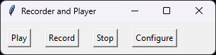

# MQTT Logger

_Couldn't be any simpler_



## Installation

```bash
pip install -r requirements.txt
```

## Usage

```bash
python logger.py
```

## Config

```toml
[recorder]
broker_address = "localhost"
topics = ["$SYS/#"]
output_dir = "data"

[player]
broker_address = "localhost"
```

## Running a simple MQTT Broker

Write the contents of the following to a file called `mosquitto.conf`:
```ini
listener 1883
allow_anonymous true
```

Run the broker with docker:
```bash
docker run -it -p 1883:1883 -p 9001:9001 -v mosquitto.conf:/mosquitto/config/mosquitto.conf eclipse-mosquitto
```